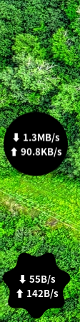

# gnome-shell-speed

- 无聊时，可以点着玩。可以随时启用/关闭。
- 鼠标在面板图标上滚动，可以改变形状。

- You can click it to have fun and pass the time. Can be turned on / off at any time.
- Scroll Mouse on panel icon, can change the shape.

---
Video:

[!(mp4)](https://github.com/eexpress/gs-speed/blob/main/gs-speed.mp4)
---
<video width="444" height="674" controls autoplay muted loop>
  <source src="gs-speed.mp4" type="video/mp4">
</video>
